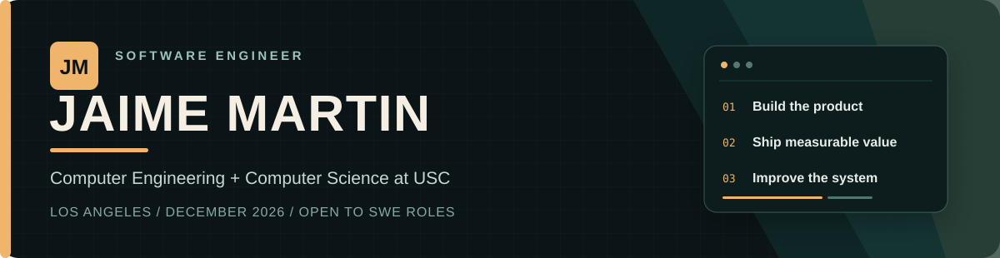

  

  
  
  

  <strong>Software engineer who connects product thinking with hands-on implementation.</strong> 
  I build full-stack platforms, applied AI systems, and software that interacts with real devices and infrastructure.

<table>
  <tr>
    <td align="center" width="25%"><strong>40+</strong> global users of a production AI platform</td>
    <td align="center" width="25%"><strong>4</strong> industry and research internships</td>
    <td align="center" width="25%"><strong>5</strong> featured engineering projects</td>
    <td align="center" width="25%"><strong>2</strong> languages: English and Spanish</td>
  </tr>
</table>

## Currently

**University of Southern California** — B.S. Computer Engineering and Computer Science, December 2026  
Minor in Engineering Entrepreneurship · GPA: **3.61**

I am looking for software engineering roles where I can own meaningful product work, learn quickly, and contribute across application, data, and systems layers.

## Experience at a glance

| | Role | Selected impact |
| --- | --- | --- |
| **HPE** | Software Engineer Intern · 2026 | Shipped an ML forecasting platform with an LLM analysis assistant to production for 40+ global stakeholders; also built an internal server-management web application. |
| **PwC** | Technology Consulting Intern · 2025 | Mapped systems, data flows, infrastructure, contracts, and spend for an international acquisition, then helped shape modernization, migration, and integration roadmaps. |
| **Verif-y** | Machine Learning Intern · 2024 | Developed ML and OCR workflows for document extraction and automation while improving the product's accessibility and usability. |
| **Villanova University** | Research Assistant Intern · 2023–2024 | Built cardiovascular risk models from real-patient ultrasound data, presented the work at a research symposium, and contributed to diagnostic-device prototypes. |

**Code the Change · Software Developer** — Building custom software for Los Angeles nonprofits. My team delivered Garden School Foundation a web and mobile volunteer platform with role-based access, check-in, attendance, event tracking, and analytics.

## Selected builds

| Project | Engineering story | Stack |
| --- | --- | --- |
| [**CityBuilder**](https://github.com/Jaime888888/CITIES_GAME_2) | A tested 3D city simulation with procedural terrain, roads and transit, zoning, weather, an evolving economy, and measurement-driven graphics work. | C#, Godot |
| [**PawStation**](https://github.com/Jaime888888/pawstation-software) | Desktop and mobile clients for a Raspberry Pi smart feeder with live polling, device controls, camera streaming, local configuration, and history visualization. | Python, React Native, Expo, REST |
| [**TicketTrader**](https://github.com/Jaime888888/TicketTrader) | A full-stack event marketplace with authentication, Ticketmaster search, favorites, wallet balances, and MySQL-backed buy/sell workflows. | Java, Servlets, JavaScript, MySQL |
| [**Study Spot Finder**](https://github.com/Jaime888888/201-final-project) | A team-built discovery platform for finding, saving, rating, and reviewing study spaces around USC. | React, Spring Boot, Java, JWT |
| [**Catan AlphaZero**](https://github.com/Jaime888888/jaime-catan) | A maintained research codebase for self-play, parallel MCTS, policy-value training, checkpoints, and arena evaluation; original history and contributor attribution are preserved. | Rust, Burn, MCTS, Slurm |

## Technical toolkit

  
  
  
  
  
  
  
  

- **Application:** React, Next.js, Node.js, REST APIs, PostgreSQL, MySQL
- **AI and data:** scikit-learn, NumPy, pandas, OCR, forecasting, LLM-powered applications
- **Systems:** Linux, Bash, Git, Docker, CI/CD, nginx, HTTP, TLS, DNS, TCP/IP
- **Hardware:** assembly language, Verilog, VHDL, QuestaSim

**Microsoft certifications:** Azure AI Fundamentals (AI-900) · Azure AI Apps and Agents Developer Associate (AI-103)

---

  <strong>Let's build something useful.</strong> 
  <a href="mailto:jaimem57@usc.edu">jaimem57@usc.edu</a> ·
  <a href="https://www.linkedin.com/in/jmartin101/">LinkedIn</a>

